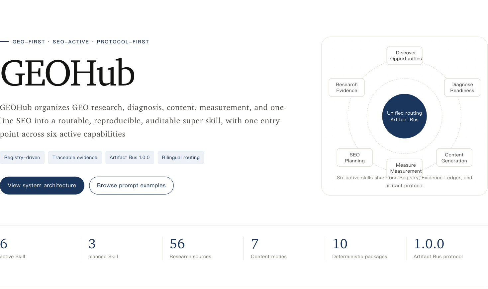
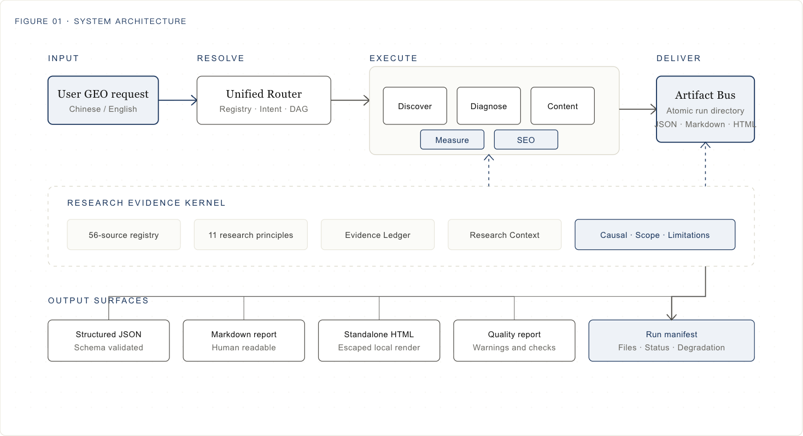
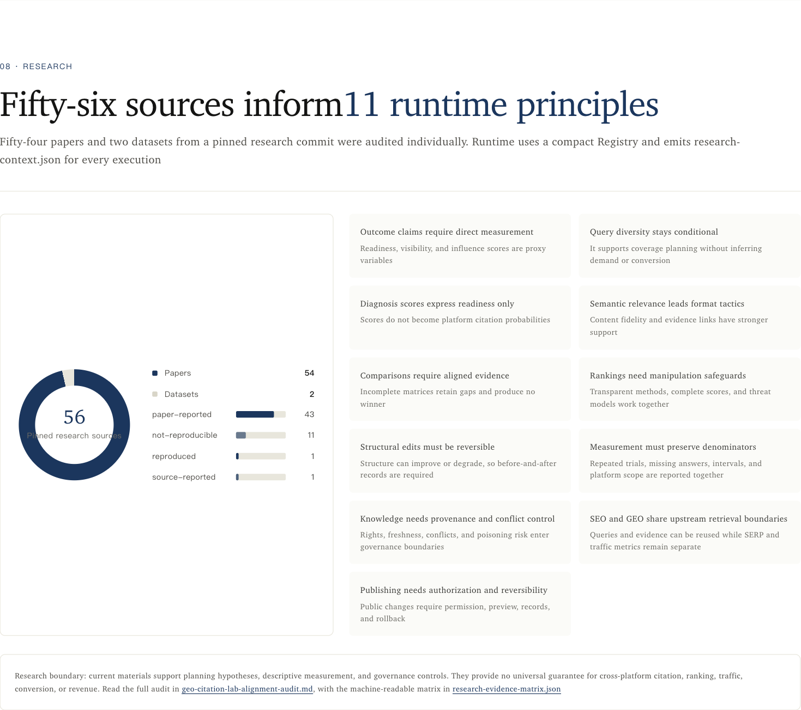

# GEOHub

**Research-grounded GEO and SEO Skill Hub for AI Search**

[English](README.md) · [简体中文](README.zh-CN.md) · [Visual guide](https://htmlpreview.github.io/?https://raw.githubusercontent.com/yaojingang/GEOHub/main/reports/geohub-visual-guide.html#lang=en) · [Architecture](docs/architecture.md) · [Installation](docs/installation.md)

**Version 0.3.1 · Experimental · GEO-first · SEO-active · Protocol-first**



GEOHub is an open agent skill library for evidence-bounded GEO and SEO work. Give it a natural-language request and the registry routes it to the smallest runnable skill or a stable workflow. Every provider execution writes a self-contained Artifact Bus run with structured results, evidence lineage, quality status, and a manifest. Research-aligned providers also write research context.

Version `0.3.1` includes six active skills, three planned routes, seven content modes, an offline measurement provider, and a dedicated one-line SEO planner. Product behavior is **Experimental**. Library-grade packaging describes the engineering gates; it does not claim production outcome quality.

The public product and Skill suite are named **GEOHub**. The Python distribution, CLI, module, installed data paths, package names, and Artifact Bus identifiers retain `geo-seo-hub` or `geo_seo_hub` for compatibility.

## Start with one prompt

The router accepts Chinese and English requests:

```bash
.venv/bin/geo-seo-hub route --text "Our organic traffic dropped after a migration. Build a read-only recovery plan."
```

| Goal | Example prompt | Route |
| --- | --- | --- |
| Find GEO opportunities | `Expand "GEO optimization company" into audience, comparison, scenario, and decision queries.` | `geo-discover` |
| Audit a page or site | `Audit this documentation page for extractability, evidence clarity, and citation readiness.` | `geo-diagnose` |
| Create bounded content | `Create an evidence-lined comparison page for these two products.` | `geo-content` |
| Measure supplied observations | `Aggregate this offline answer and citation observation file by platform.` | `geo-measure` |
| Plan SEO work | `Traffic fell after migration. Check indexation, redirects, canonicals, templates, and Search Console evidence.` | `seo` |
| Run a baseline workflow | `Discover the main questions for this brand, then diagnose the site.` | `brand-baseline-lite` |

Planned requests for strategy, knowledge, or publishing return availability metadata, required inputs, and the nearest active capability. They do not execute hidden or incomplete behavior.

## How it works



1. The registry declares capability status, intents, entrypoints, input contracts, and outputs.
2. The resolver selects one active skill or one exact workflow DAG.
3. Each provider validates a bounded brief and runs deterministic logic.
4. The research kernel attaches source scope, causal status, proxy limits, and evidence rules.
5. The Artifact Bus publishes the complete run atomically after file and manifest validation.

The protocol stays at `1.0.0`. Existing Artifact Bus consumers can read version `0.3.1` runs while newer artifacts add research context, measurement reports, diagnosis funnels, content evidence units, and SEO plans.

## Active skills

| Skill | Main job | Primary artifacts |
| --- | --- | --- |
| `geo` | Chinese and English routing, planned-state reporting, workflow selection | route decision, optional DAG |
| `geo-discover` | Query expansion and opportunity discovery from a bounded brief | query map, opportunity map, evidence ledger |
| `geo-diagnose` | Brand, site, and page diagnosis from explicit sources | diagnosis, eligibility-to-absorption funnel, remediation maps |
| `geo-content` | Seven evidence-lined content modes | content spec, evidence units, Markdown, JSON, HTML, optional DOCX/PDF |
| `geo-measure` | Descriptive aggregation of user-supplied observations | measurement report, intervals, platform strata |
| `seo` | One-line SEO scoping and action planning | SEO plan, coverage ledger, evidence gaps, guardrails |

The three planned routes are `geo-strategy`, `geo-knowledge`, and `geo-publish`.

### Seven content modes

`title`, `explainer`, `comparison`, `ranking`, `page-blueprint`, `refine`, and `article-friendly` share evidence lineage, quality checks, and the same Artifact Bus contract.

## Where it fits

| Area | Supported scenarios |
| --- | --- |
| GEO discovery | Seed expansion, audience questions, comparison queries, scenario clusters, decision-stage questions, content opportunities |
| GEO diagnosis | Brand baseline, website audit, page audit, evidence gaps, entity clarity, structured extractability |
| Content | Titles, explainers, neutral comparisons, evidence-complete rankings, page blueprints, existing-content refinement |
| Measurement | Offline answer rate, citation rate, missing answers, exclusions, platform strata, Wilson intervals |
| SEO | Technical audit planning, keyword-to-page mapping, migration recovery, Search Console incidents, experiments, international SEO, ecommerce SEO, authorized implementation plans |

GEO and SEO share upstream intent, source, entity, page, and content structures. Live SERP collection, ranking data, traffic data, platform sampling, and account mutation require external connectors and explicit authorization.

## One-line SEO

The `seo` provider converts one request into a bounded plan. It classifies the work mode, records available evidence, lists missing inputs, defines read-only or authorized actions, and adds rollback boundaries where implementation is allowed.

Run the included example:

```bash
.venv/bin/geo-seo-hub seo \
  --input skills/seo/references/input-example.json \
  --output runs
```

The provider performs no live crawl, Search Console login, CMS mutation, or ranking lookup. Its output is a rerunnable plan with explicit evidence and permission gaps.

## Artifact Bus

Each successful provider run publishes one self-contained directory:

```text
runs/run-<id>/
├── input/
├── evidence-ledger.json
├── quality-report.json
├── run-manifest.json
├── research-context.json
└── <provider-specific files>
```

`research-context.json` is emitted by discover, diagnose, content, and measure. Provider-specific files include `query-map.json`, `opportunity-map.json`, `diagnosis-funnel.json`, `content-evidence-units.json`, `measurement-report.json`, and `seo-plan.json`. Content may also emit standalone HTML and optional DOCX/PDF.

## Research-grounded methods



The research registry maps 54 papers and two datasets to 11 runtime principles. The implementation separates source-reported findings, reproduced results, non-reproducible claims, proxy metrics, and descriptive measurement. Discover, diagnose, content, and measure runs emit a `research-context.json` artifact with scope and limitation metadata.

Read the [research alignment audit](docs/research/geo-citation-lab-alignment-audit.md) and the [machine-readable evidence matrix](reports/research-evidence-matrix.json) for source-level details.

## Safety boundaries

- Missing evidence stays `unknown`, `unverified`, `source_gap`, or `blocked-by-evidence`.
- Diagnosis only fetches explicit public canonical HTTP(S) URLs without query strings and performs no crawl expansion.
- Content runs offline, snapshots relative source files, and escapes user text in standalone HTML.
- Measurement accepts bounded file-backed observations and performs no platform collection.
- SEO produces deterministic scope and planning artifacts with no live collection or mutation.
- Rankings, citations, traffic, conversions, and revenue carry no outcome guarantee.

## Install and run

Supported Python range: `3.11-3.14`.

```bash
git clone https://github.com/yaojingang/GEOHub.git
cd GEOHub
python3 -m venv .venv
.venv/bin/python -m pip install .
.venv/bin/geo-seo-hub --version
.venv/bin/geo-seo-hub route --text "Help me find AI search questions for a team knowledge base."
```

For development:

```bash
.venv/bin/python -m pip install -e '.[dev]'
.venv/bin/python scripts/verify_all.py
```

See [Installation](docs/installation.md) for provider packages, Codex and Claude adapters, optional render dependencies, and migration notes.

## Packaging and quality gates

Version `0.3.1` builds ten deterministic community packages: source, unified, six provider packages, Codex, and Claude. Nine non-source packages are installed and exercised in isolated environments by the release gate.

The current fixed evaluation set contains 374 router cases, 40 trigger cases, and 30 deterministic output cases. It requires router precision and recall of `1.0`, trigger and output contract compliance of `1.0`, and zero fabricated citations. The external `yao-meta-skill` run records 79 commands, 15 explicit evidence waivers, and zero release blockers.

```bash
python3 scripts/package.py --target all --channel community
python3 scripts/verify_packages.py
python3 scripts/install_simulation.py --target all
```

Version `0.3.1` has no GitHub Release or prebuilt release assets. Build packages from a source checkout.

## License and governance

The repository uses `AGPL-3.0-only`. Commercial licensing is available under a separate signed agreement and currently has `inquiry_only` status. See [Commercial Licensing](COMMERCIAL-LICENSING.md), [License Scope](LICENSE-SCOPE.md), and [Third-Party Notices](THIRD_PARTY_NOTICES.md).

The contributor agreement remains under legal review, so external code merges are paused. Issues, documentation suggestions, and private security reports remain welcome.

Copyright © 2026 姚金刚 / Yao.
