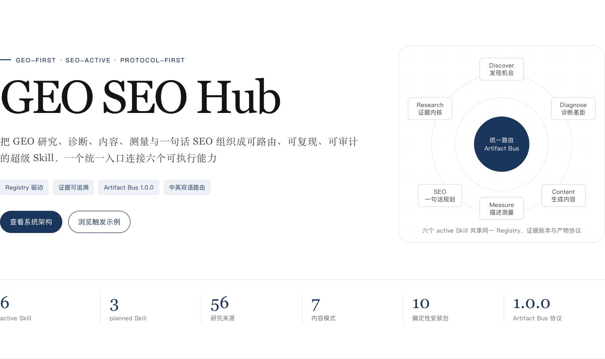
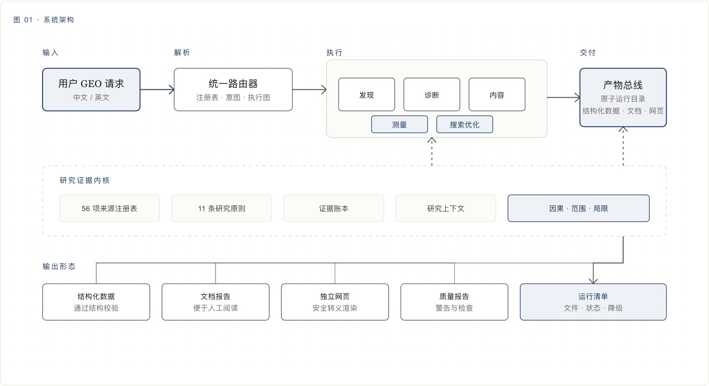
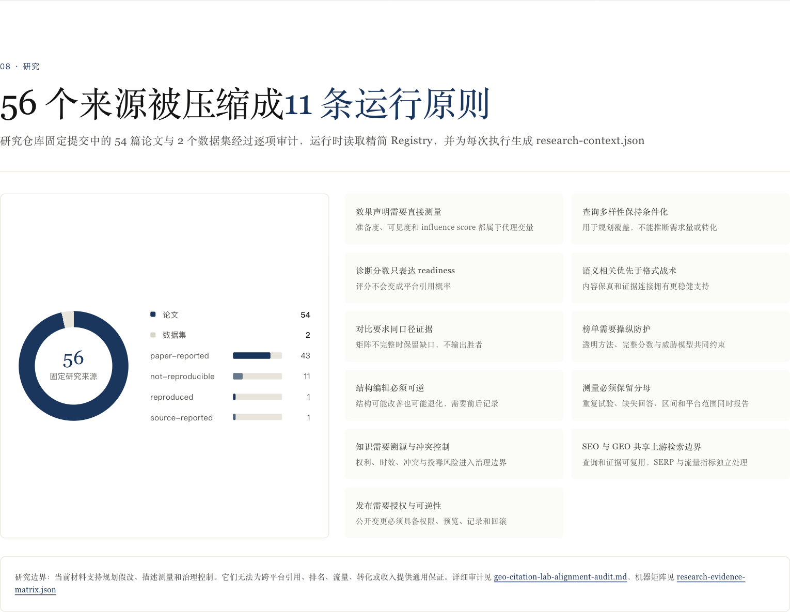

# GEO SEO Hub

[English](README.md) · [简体中文](README.zh-CN.md) · [可视化指南](https://htmlpreview.github.io/?https://raw.githubusercontent.com/yaojingang/geo-seo-hub/main/reports/geo-seo-hub-visual-guide.html) · [架构说明](docs/architecture.md) · [安装说明](docs/installation.md)

**版本 0.3.0 · 实验性 · GEO 优先 · SEO 已启用 · 协议优先**



GEO SEO Hub 是一个面向 GEO 与 SEO 工作流的开放式 Agent Skill 合集。用户输入自然语言请求后，注册表路由器会选择最小可执行 Skill 或稳定工作流。每次能力执行都会生成一个自包含的 Artifact Bus 运行目录，集中保存结构化结果、证据血缘、质量状态与运行清单。科研对齐能力还会写入研究上下文。

`0.3.0` 版本包含 6 个可执行 Skill、3 个规划中路由、7 种内容模式、离线测量能力和独立的一句话 SEO 规划入口。当前产品成熟度为 **Experimental**。Library 级工程门禁代表打包与验证强度，不代表线上效果承诺。

## 从一句话开始

路由器同时支持中文和英文请求：

```bash
.venv/bin/geo-seo-hub route --text "网站迁移后自然流量下滑，请生成一份只读排查与恢复计划"
```

| 目标 | 提示词示例 | 路由结果 |
| --- | --- | --- |
| 发现 GEO 机会 | `围绕“GEO 优化公司”拓展受众、对比、场景和决策类问题` | `geo-discover` |
| 诊断页面或网站 | `诊断这个产品文档页的可提取性、证据清晰度和引用准备度` | `geo-diagnose` |
| 生成证据约束内容 | `根据这些证据生成两个产品的中立对比页` | `geo-content` |
| 测量离线观测 | `按照平台汇总这份离线回答与引用观测文件` | `geo-measure` |
| 规划 SEO 工作 | `网站迁移后流量下降，检查收录、重定向、规范链接、模板和 Search Console 证据` | `seo` |
| 执行基线工作流 | `先发现这个品牌的核心问题，再诊断网站` | `brand-baseline-lite` |

策略、知识和发布类规划中请求会返回可用状态、所需输入与最接近的可执行能力，不会执行未完成的隐藏逻辑。

## 工作原理



1. 注册表声明能力状态、意图、入口、输入契约和输出。
2. 解析器选择一个可执行 Skill 或一个确定的工作流执行图。
3. 每个能力提供者校验有限输入，并执行确定性逻辑。
4. 研究证据内核附加来源范围、因果状态、代理变量限制和证据规则。
5. Artifact Bus 完成文件集与运行清单校验后，原子发布完整运行目录。

协议版本保持为 `1.0.0`。现有 Artifact Bus 消费者可以读取 `0.3.0` 运行结果，新版产物增加研究上下文、测量报告、诊断漏斗、内容证据单元和 SEO 计划。

## 当前可执行能力

| Skill | 主要任务 | 核心产物 |
| --- | --- | --- |
| `geo` | 中英文路由、planned 状态说明、工作流选择 | 路由决策、可选执行图 |
| `geo-discover` | 根据有限 Brief 拓展查询并发现机会 | 查询地图、机会地图、证据账本 |
| `geo-diagnose` | 根据明确来源完成品牌、站点和页面诊断 | 诊断结果、资格到吸收漏斗、修复地图 |
| `geo-content` | 生成 7 类证据约束内容 | 内容规格、证据单元、Markdown、JSON、HTML、可选 DOCX/PDF |
| `geo-measure` | 聚合用户提供的离线观测 | 测量报告、区间、平台分层 |
| `seo` | 将一句话 SEO 请求转成范围明确的行动计划 | SEO 计划、覆盖账本、证据缺口、执行边界 |

3 个规划中路由为 `geo-strategy`、`geo-knowledge` 和 `geo-publish`。

### 七种内容模式

`title`、`explainer`、`comparison`、`ranking`、`page-blueprint`、`refine` 和 `article-friendly` 共用证据血缘、质量检查与 Artifact Bus 协议。

## 适用场景

| 能力范围 | 支持的场景 |
| --- | --- |
| GEO 发现 | 词根拓展、受众问题、对比问题、场景聚类、决策问题、内容机会 |
| GEO 诊断 | 品牌基线、网站诊断、页面诊断、证据缺口、实体清晰度、结构化可提取性 |
| 内容生产 | 标题、解释型内容、中立对比、证据完整榜单、页面蓝图、已有内容优化 |
| 测量分析 | 离线回答率、引用率、缺失回答、排除原因、平台分层、Wilson 区间 |
| SEO | 技术审计规划、关键词与页面映射、迁移恢复、Search Console 异常、实验、国际 SEO、电商 SEO、授权实施计划 |

GEO 与 SEO 共用上游意图、来源、实体、页面和内容结构。实时 SERP 采集、排名数据、流量数据、平台采样和账户修改需要外部连接器与明确授权。

## 一句话 SEO

`seo` 能力会把一句话请求转换为范围明确的计划。它会识别工作模式，登记已有证据，列出缺失输入，定义只读或授权操作，并在允许实施时补充回滚边界。

运行仓库中的示例：

```bash
.venv/bin/geo-seo-hub seo \
  --input skills/seo/references/input-example.json \
  --output runs
```

该能力不会执行实时爬取、Search Console 登录、CMS 修改或排名查询。输出是一份带有证据缺口和权限边界的可重放计划。

## Artifact Bus 产物协议

每个成功执行的能力都会发布一个自包含目录：

```text
runs/run-<id>/
├── input/
├── evidence-ledger.json
├── quality-report.json
├── run-manifest.json
├── research-context.json
└── <能力专属文件>
```

发现、诊断、内容与测量能力会生成 `research-context.json`。不同能力还会生成 `query-map.json`、`opportunity-map.json`、`diagnosis-funnel.json`、`content-evidence-units.json`、`measurement-report.json` 和 `seo-plan.json`。内容能力还可以输出独立 HTML 以及可选的 DOCX/PDF。

## 科研依据



研究注册表把 54 篇论文和 2 个数据集映射为 11 条运行原则。实现会区分来源报告、已复现结果、不可复现结论、代理变量和描述性测量。发现、诊断、内容与测量能力会生成包含适用范围与局限的 `research-context.json`。

来源级信息请查看[科研对齐审计](docs/research/geo-citation-lab-alignment-audit.md)与[机器可读证据矩阵](reports/research-evidence-matrix.json)。

## 安全边界

- 缺失证据会保留为 `unknown`、`unverified`、`source_gap` 或 `blocked-by-evidence`。
- 诊断能力只读取用户明确提供的公开规范 HTTP(S) 地址，不接受查询参数，也不会扩展爬取范围。
- 内容能力离线运行，会保存相对来源文件快照，并在独立 HTML 中转义用户文本。
- 测量能力只接受有界的本地观测文件，不连接外部平台。
- SEO 能力只生成确定性的范围和规划产物，不执行实时采集或修改。
- 排名、引用、流量、转化和收入均无效果保证。

## 安装与运行

支持 Python `3.11-3.14`。

```bash
git clone https://github.com/yaojingang/geo-seo-hub.git
cd geo-seo-hub
python3 -m venv .venv
.venv/bin/python -m pip install .
.venv/bin/geo-seo-hub --version
.venv/bin/geo-seo-hub route --text "帮我拓展团队知识库相关的 AI 搜索问题"
```

开发模式：

```bash
.venv/bin/python -m pip install -e '.[dev]'
.venv/bin/python scripts/verify_all.py
```

能力包、Codex 与 Claude 适配包、可选渲染依赖和迁移说明见[安装文档](docs/installation.md)。

## 打包与质量门禁

`0.3.0` 可以构建 10 个确定性社区安装包，包括源码包、统一包、6 个能力包、Codex 适配包和 Claude 适配包。发布门禁会在隔离环境中安装并执行 9 个非源码包。

当前固定评估集包含 373 条路由用例、39 条触发用例和 30 条确定性输出用例。门禁要求路由精确率与召回率均为 `1.0`，触发与输出契约合规率均为 `1.0`，虚构引用数量为 0。外部 `yao-meta-skill` 共执行 79 项命令，登记 15 项明确证据豁免，发布阻断项为 0。

```bash
python3 scripts/package.py --target all --channel community
python3 scripts/verify_packages.py
python3 scripts/install_simulation.py --target all
```

`0.3.0` 暂无 GitHub Release 或预构建发布资产，请从源码仓库构建安装包。

## 授权与治理

仓库采用 `AGPL-3.0-only`。商业授权需要单独签署协议，当前状态为 `inquiry_only`。详细边界见[商业授权说明](COMMERCIAL-LICENSING.md)、[许可范围](LICENSE-SCOPE.md)和[第三方声明](THIRD_PARTY_NOTICES.md)。

贡献者协议仍在法律审核阶段，外部代码合并暂时关闭。问题反馈、文档建议和私密安全报告保持开放。

版权所有 © 2026 姚金刚 / Yao。
